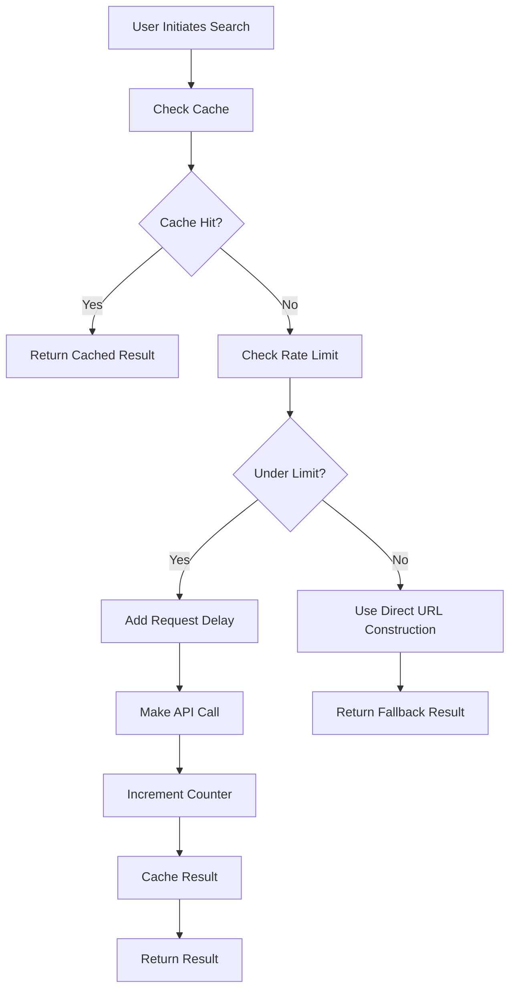

# Playlist Page: Caching Strategy & Rate Limiting Implementation

## Overview

This document describes the comprehensive caching strategy and rate limiting system implemented for the playlist minimal page to optimize API usage, improve performance, and provide a better user experience when searching for CifraClub chord URLs.

## Table of Contents

1. [Implementation Summary](#implementation-summary)
2. [Caching Strategy](#caching-strategy)
3. [Rate Limiting System](#rate-limiting-system)
4. [UI/UX Enhancements](#uiux-enhancements)
5. [Technical Architecture](#technical-architecture)
6. [API Reference](#api-reference)
7. [Configuration](#configuration)
8. [Usage Examples](#usage-examples)
9. [Troubleshooting](#troubleshooting)

## Implementation Summary

### Key Features Added

- **24-hour persistent caching** with localStorage support
- **Conservative rate limiting** (80 requests/day out of 100 quota)
- **Intelligent fallback mechanisms** when API limits are reached
- **Real-time cache and API usage indicators** in the UI
- **Manual cache management** with clear cache functionality
- **Sequential search processing** to respect rate limits
- **Automatic quota reset** handling

### Benefits

- ✅ **Reduced API Usage**: Cache hits eliminate redundant API calls
- ✅ **Improved Performance**: Instant results from cache
- ✅ **Rate Limit Compliance**: Automatic throttling prevents quota errors
- ✅ **Better UX**: Transparent caching with status indicators
- ✅ **Persistent State**: Cache survives browser sessions
- ✅ **Robust Fallbacks**: Multiple strategies ensure results

## Caching Strategy

### Cache Structure

```typescript
interface CacheEntry {
  urls: string[];
  timestamp: number;
  source: "api" | "direct" | "cache" | "fresh";
}

const searchCache: Record<string, CacheEntry> = {};
```

### Cache Behavior

#### Cache Key Generation

- **Format**: Lowercase trimmed song query
- **Example**: `"arctic monkeys - do i wanna know"` → `"arctic monkeys - do i wanna know"`

#### Cache Validation

- **Duration**: 24 hours (86,400,000 milliseconds)
- **Check**: `Date.now() - entry.timestamp < CACHE_DURATION`
- **Auto-cleanup**: Expired entries ignored but not automatically deleted

#### Cache Storage

- **In-Memory**: React state for runtime access
- **Persistent**: localStorage for cross-session persistence
- **Key**: `"cifra-search-cache"`
- **Format**: JSON string of cache object

### Cache Lifecycle

1. **Load**: On component mount, load from localStorage
2. **Filter**: Remove expired entries during load
3. **Hit**: Check cache before any API call
4. **Miss**: Perform API call and cache successful results
5. **Store**: Save to both state and localStorage
6. **Cleanup**: Manual clearing via UI button

### Cache Management Functions

```typescript
// Check if cache entry is valid
const isCacheValid = (timestamp: number): boolean => {
  return Date.now() - timestamp < CACHE_DURATION;
};

// Clear all cache data
const clearAllCache = () => {
  setSearchCache({});
  setCifraUrls({});
  localStorage.removeItem("cifra-search-cache");
};

// Get cache statistics
const getCacheStats = () => {
  const totalCached = Object.keys(searchCache).length;
  const validCached = Object.entries(searchCache).filter(([_, entry]) =>
    isCacheValid(entry.timestamp)
  ).length;
  const expiredCached = totalCached - validCached;

  return { totalCached, validCached, expiredCached };
};
```

## Rate Limiting System

### Rate Limit Configuration

```typescript
const MAX_API_REQUESTS_PER_DAY = 80; // Conservative limit (80/100)
const REQUEST_DELAY = 500; // 500ms delay between requests
const DAILY_RESET_HOUR = 0; // Midnight PT reset time
```

### Rate Limit State

```typescript
interface RateLimitState {
  requestCount: number; // Current request count
  lastResetTime: number; // Timestamp of last reset
  isThrottled: boolean; // Whether we're currently throttled
}
```

### Rate Limiting Logic

#### Request Flow

1. **Check Reset**: Verify if 24 hours have passed since last reset
2. **Check Limit**: Compare current count against daily maximum
3. **Throttle**: If limit reached, use direct URL construction
4. **Delay**: Add 500ms delay between API requests
5. **Count**: Increment counter after each API call
6. **Persist**: Save state to localStorage

#### Automatic Reset

```typescript
const checkAndResetRateLimit = () => {
  const now = Date.now();
  const timeSinceReset = now - rateLimitState.lastResetTime;
  const hoursPassedSinceReset = timeSinceReset / (1000 * 60 * 60);

  if (hoursPassedSinceReset >= 24) {
    setRateLimitState({
      requestCount: 0,
      lastResetTime: now,
      isThrottled: false,
    });
    return true;
  }
  return false;
};
```

#### API Usage Decision

```typescript
const shouldUseAPI = (): boolean => {
  checkAndResetRateLimit();

  if (rateLimitState.requestCount >= MAX_API_REQUESTS_PER_DAY) {
    setRateLimitState((prev) => ({ ...prev, isThrottled: true }));
    return false;
  }

  return true;
};
```

## UI/UX Enhancements

### Cache Indicators

- **💾 Icon**: Shows when results are from cache
- **Cache Stats**: Displays valid/expired cache counts
- **Clear Cache Button**: Orange button with tooltip showing stats

### Rate Limit Display

- **🚦 Icon**: Shows API usage count (X/80 requests today)
- **Throttled Warning**: Yellow text when rate limited
- **Progress Tracking**: Real-time updates during batch searches

### Status Messages

- **Cache Hit**: `"💾 [PLAYLIST MINIMAL] Using cached result for: [song]"`
- **Rate Limited**: `"🚫 [PLAYLIST MINIMAL] API rate limit reached"`
- **Fallback Used**: `"🔄 [PLAYLIST MINIMAL] Using direct URL construction"`

### User Feedback

- **API Issues**: Yellow warning box with explanation
- **Cache Status**: Small text showing cache and API usage
- **Progress Bar**: Animated progress during batch searches

## Technical Architecture

### Search Flow with Caching & Rate Limiting



### State Management

#### Component State Structure

```typescript
// Caching state
const [searchCache, setSearchCache] = useState<CacheRecord>({});

// Rate limiting state
const [rateLimitState, setRateLimitState] = useState<RateLimitState>({
  requestCount: 0,
  lastResetTime: Date.now(),
  isThrottled: false,
});

// Search status for UI
const [searchStatus, setSearchStatus] = useState<SearchStatus>({
  isSearching: boolean,
  totalSongs: number,
  completedSongs: number,
  totalUrls: number,
  failedSongs: number,
  apiIssueDetected: boolean,
});
```

#### localStorage Integration

```typescript
// Save cache on change
useEffect(() => {
  if (typeof window !== "undefined") {
    localStorage.setItem("cifra-search-cache", JSON.stringify(searchCache));
  }
}, [searchCache]);

// Save rate limit state on change
useEffect(() => {
  if (typeof window !== "undefined") {
    localStorage.setItem("cifra-rate-limit", JSON.stringify(rateLimitState));
  }
}, [rateLimitState]);
```

### Batch Search Optimization

#### Sequential Processing

```typescript
// Search songs sequentially to respect rate limiting
for (let i = 0; i < songs.length; i++) {
  const song = songs[i];
  await handleArtistSongSearch(song.displayText);

  // Small delay between songs
  if (i < songs.length - 1) {
    await new Promise((resolve) => setTimeout(resolve, 100));
  }
}
```

## API Reference

### Core Functions

#### `handleArtistSongSearch(query: string)`

Main search function with caching and rate limiting.

**Parameters:**

- `query`: Song query in "Artist - Song" format

**Returns:**

- `Promise<void>`: Updates component state with results

**Behavior:**

1. Check cache for existing result
2. If cache miss, check rate limit
3. If under limit, make API call with delay
4. If over limit, use direct URL construction
5. Cache successful results
6. Update UI state

#### `clearAllCache()`

Clears all cached search results.

**Side Effects:**

- Clears `searchCache` state
- Clears `cifraUrls` state
- Removes `cifra-search-cache` from localStorage

#### `getCacheStats()`

Returns cache statistics for UI display.

**Returns:**

```typescript
{
  totalCached: number,
  validCached: number,
  expiredCached: number
}
```

#### `shouldUseAPI(): boolean`

Determines whether to use API or fallback method.

**Returns:**

- `true`: API usage allowed
- `false`: Rate limit reached, use fallback

**Side Effects:**

- May reset rate limit counter if 24h passed
- May set `isThrottled` flag

### Configuration Constants

```typescript
const CACHE_DURATION = 24 * 60 * 60 * 1000; // 24 hours
const MAX_API_REQUESTS_PER_DAY = 80; // Conservative limit
const REQUEST_DELAY = 500; // Delay between requests
```

## Configuration

### Environment Variables

No additional environment variables required. Uses existing:

- `NEXT_PUBLIC_SPOTIFY_TOKEN`: For Spotify API access

### Customizable Parameters

#### Cache Duration

```typescript
const CACHE_DURATION = 24 * 60 * 60 * 1000; // 24 hours in milliseconds
```

**Options:** Any positive number in milliseconds
**Recommended:** 12-72 hours for chord data

#### Rate Limit

```typescript
const MAX_API_REQUESTS_PER_DAY = 80; // Out of 100 quota
```

**Options:** 1-100 (Google Custom Search API limit)
**Recommended:** 70-90 for safety margin

#### Request Delay

```typescript
const REQUEST_DELAY = 500; // 500ms between requests
```

**Options:** 100-2000ms
**Recommended:** 300-1000ms to be respectful to API

## Usage Examples

### Basic Search with Caching

```typescript
// First search - API call made, result cached
await handleArtistSongSearch("Arctic Monkeys - Do I Wanna Know");

// Second search within 24h - cache hit, instant result
await handleArtistSongSearch("Arctic Monkeys - Do I Wanna Know");
```

### Batch Search with Rate Limiting

```typescript
// Searches songs sequentially, respects rate limits
const songs = getSortedSongs();
await searchAllSongs(); // Processes all songs with delays
```

### Manual Cache Management

```typescript
// Clear all cached data
clearAllCache();

// Check cache statistics
const stats = getCacheStats();
console.log(`${stats.validCached} valid, ${stats.expiredCached} expired`);
```

### Rate Limit Monitoring

```typescript
// Check current usage
console.log(
  `API Usage: ${rateLimitState.requestCount}/${MAX_API_REQUESTS_PER_DAY}`
);

// Manual reset (for development)
resetRateLimit();
```

## Troubleshooting

### Common Issues

#### Cache Not Persisting

**Symptoms:** Cache clears on page reload
**Causes:** localStorage disabled, quota exceeded, private browsing
**Solutions:**

- Check browser localStorage settings
- Clear browser data to reset quota
- Disable private/incognito mode

#### Rate Limit Not Resetting

**Symptoms:** Still throttled after 24 hours
**Causes:** Clock changes, browser storage issues
**Solutions:**

- Clear localStorage manually: `localStorage.removeItem('cifra-rate-limit')`
- Use browser dev tools to inspect stored data
- Call `resetRateLimit()` function manually

#### API Issues Despite Rate Limiting

**Symptoms:** Still getting quota errors
**Causes:** Multiple tabs, external API usage, Google account limits
**Solutions:**

- Close other tabs using the same API key
- Check Google Cloud Console for actual usage
- Reduce `MAX_API_REQUESTS_PER_DAY` value

#### Cache Showing Stale Data

**Symptoms:** Old URLs returned for updated songs
**Causes:** Cache not expiring properly
**Solutions:**

- Use "Clear Cache" button in UI
- Check `CACHE_DURATION` setting
- Verify cache timestamp validation logic

### Debug Information

#### Enable Detailed Logging

All cache and rate limit operations include detailed console logging:

- `💾 [PLAYLIST MINIMAL]`: Cache operations
- `🚦 [PLAYLIST MINIMAL]`: Rate limit operations
- `🔍 [PLAYLIST MINIMAL]`: API calls
- `🔄 [PLAYLIST MINIMAL]`: Fallback operations

#### Inspect Storage Data

```javascript
// Check cache data
console.log(JSON.parse(localStorage.getItem("cifra-search-cache")));

// Check rate limit data
console.log(JSON.parse(localStorage.getItem("cifra-rate-limit")));
```

#### Reset Everything

```javascript
// Clear all data and reset
localStorage.removeItem("cifra-search-cache");
localStorage.removeItem("cifra-rate-limit");
location.reload();
```

## Performance Impact

### Positive Impacts

- **Reduced API Calls**: Up to 100% cache hit rate for repeated searches
- **Faster Response Times**: Cache hits provide instant results
- **Lower Bandwidth**: No network requests for cached data
- **Better Reliability**: Fallback methods ensure results even when API fails

### Considerations

- **Memory Usage**: Cache stored in browser memory and localStorage
- **Storage Space**: localStorage has ~5-10MB limit per domain
- **Initial Load Time**: Slight increase due to cache loading from localStorage

### Monitoring Recommendations

- Monitor cache hit ratio for optimization opportunities
- Track API usage patterns to adjust rate limits
- Watch for localStorage quota warnings
- Monitor fallback usage frequency

## Future Enhancements

### Potential Improvements

1. **Cache Compression**: Implement compression for localStorage data
2. **Smart Prefetching**: Preload likely searches based on patterns
3. **Cache Sharing**: Share cache between different playlist pages
4. **Advanced Analytics**: Track cache performance metrics
5. **User Preferences**: Allow users to configure cache/rate limit settings
6. **Background Sync**: Refresh cache proactively in background
7. **Partial Cache Invalidation**: Invalidate specific entries rather than all

### API Integration Opportunities

1. **Multiple Search Providers**: Add Songsterr, Ultimate Guitar as fallbacks
2. **Bulk API Endpoints**: Use batch requests if available
3. **Webhook Updates**: Real-time cache invalidation
4. **CDN Integration**: Cache at edge locations

---

_Last Updated: June 28, 2025_
_Version: 1.0.0_
_Author: GitHub Copilot Implementation_
